# The Hotel

**The Hotel** is a full-stack hotel management system built as my Portfolio of Evidence (POE) during my internship at 1Nebula.  
The project showcases my understanding and ability to architecture and build a complete real-world application that supports both hotel visitors and hotel staff, with a focus on digitising room service.

The idea behind the project is simple:  
Room service is still commonly handled via telephone calls and hand written notes, which is often a manual, slow, and error-prone process.  
The Hotel modernises this by introducing a digital, e-commerce-style room service experience with real-time updates and messaging.

[Demo video on Youtube: https://youtu.be/oFofIzm1wIs](https://youtu.be/oFofIzm1wIs)

- [Backend README.md](/TheHotelAPI/README.md)
- [Frontend README.md](/TheHotelFrontend/TheHotel/README.md)

---

## Project Purpose

This project was built to demonstrate:

- Full-stack application development
- Secure authentication and authorization
- Real-time communication using SignalR
- Clean and maintainable architecture
- Practical AI integration using Google Gemini

I’ve included a [Design Choices](/TheHotelAPI/README.md#design-choices) section to explain some of the decisions I made while building this project. If you come across something that seems unusual or unclear (hopefully not 😄), please refer to that section first. If your question isn’t answered there, feel free to reach out, I’d love to hear your thoughts and discuss it further

---
## High-level Architectural Diagram
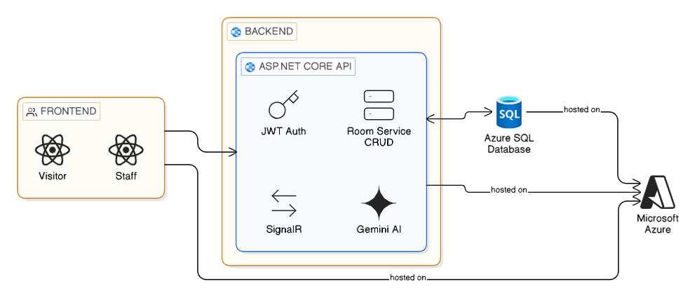  

### Tech Stack

#### Frontend
- **React**
- TypeScript  
- Vite  
- Material UI  
- Axios  
- TanStack Query  
- SignalR  
- Zustand  
- Recharts  

Architecture: Bulletproof Architecture

#### Backend
- **ASP.NET Core 8**
- **C#**  
- **Entity Framework Core**
- JWT Authentication  
- SignalR
- Gemini AI

Architecture: Onion Architecture

#### Backend Testing
- NUnit  
- FluentAssertions  
- Moq  
- AutoFixture  

#### Database
- SQL Server  

#### Cloud Resources
- Microsoft Azure  

---

## System Users

The application supports two main user roles:

##### Hotel Visitor (Guest)
Guests can manage their stay and order room service digitally.

##### Hotel Staff
Staff can manage incoming orders, communicate with guests, and monitor hotel activity.

---

## Key Features

#### Guest Features
- Secure login and registration
- View booking details
- Browse the hotel menu
- View meal details
- Add meals to a cart
- Add notes or special instructions to meals  
  - These notes are validated using Google Gemini AI to prevent profanity or inappropriate content
- Checkout and place room service orders
- View order history and order details
- Receive real-time order status updates via SignalR  
  - When staff updates an order, a toast notification is shown to the guest
- Real-time chat with hotel staff using SignalR
- Explore nearby activities and places around the hotel

#### Staff Features
- Secure staff login
- View all incoming orders
- View detailed order information
- Update order statuses (e.g. preparing, on the way, completed)
- Send and receive messages from guests in real time
- View basic analytics and insights

--- 

## Screenshots

### Authentication
***Login Page***
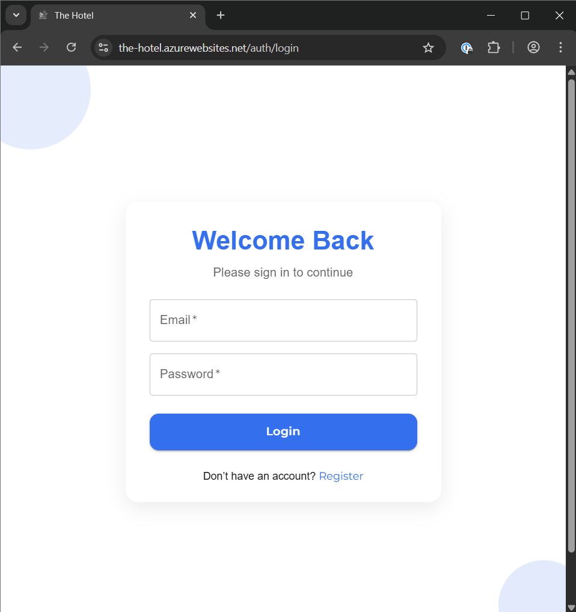
***Register Page***
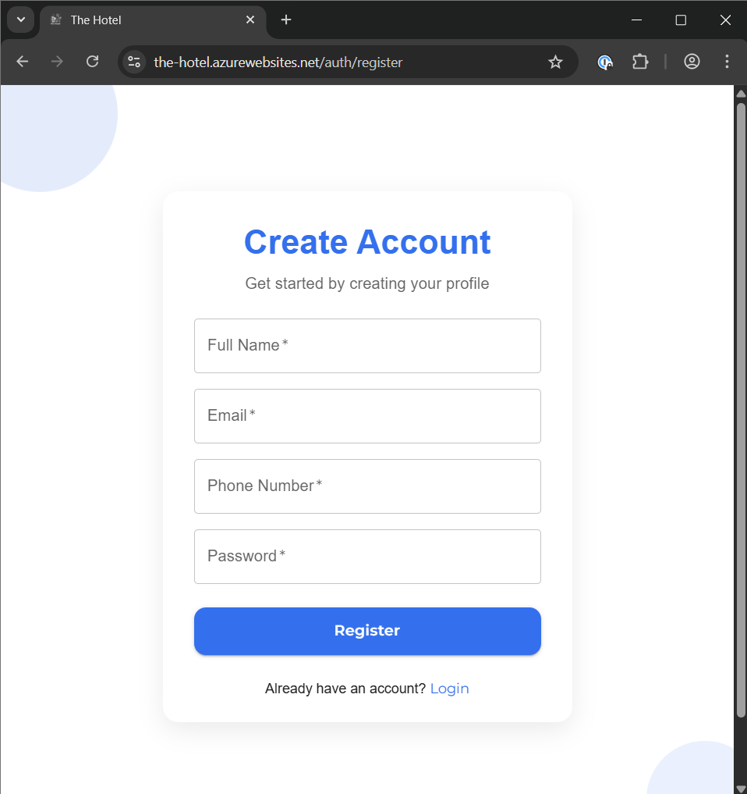

### Guest Views
***User Dashboard***
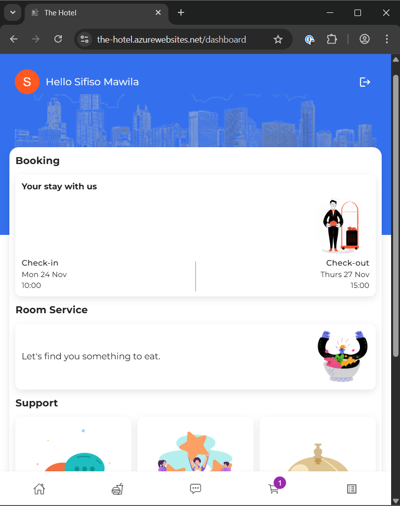

***Menu List Page***
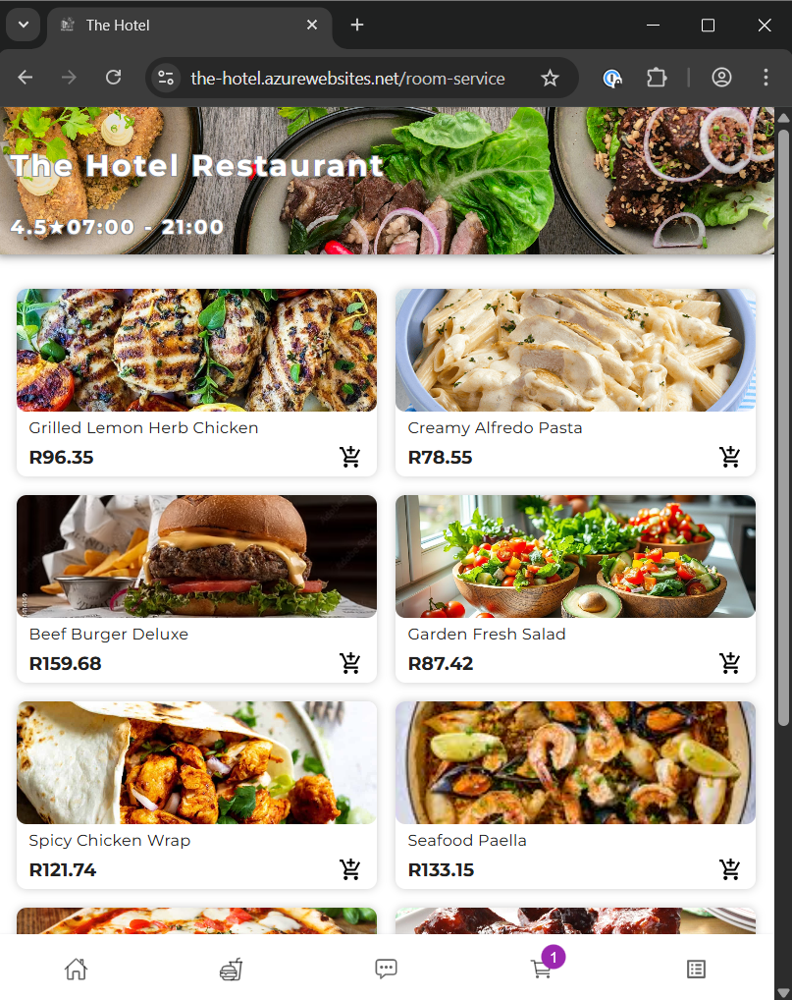

***Meal Details Page***  
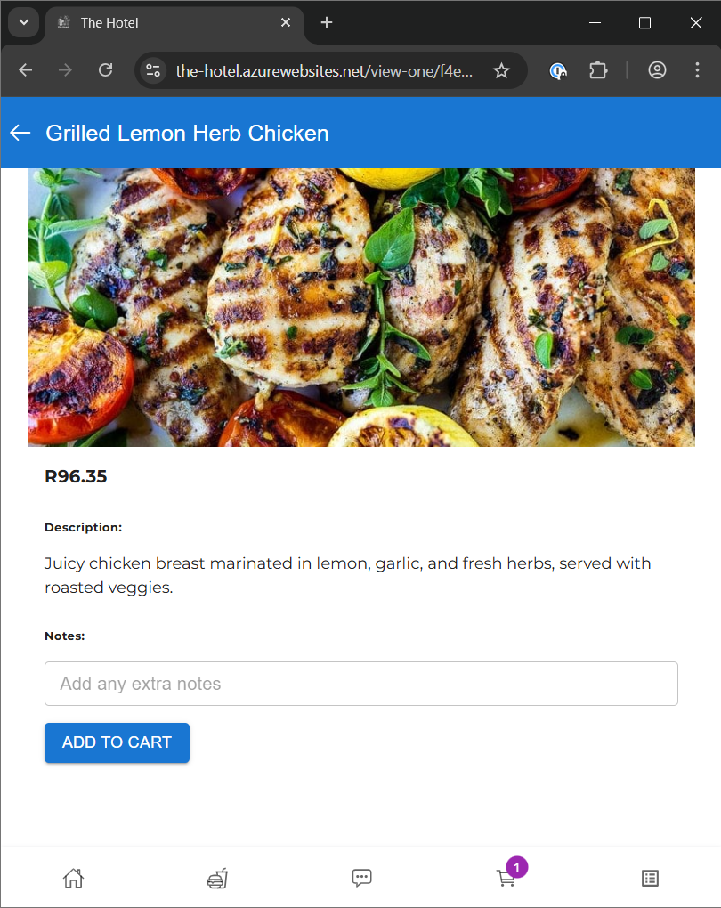

***Cart Page***
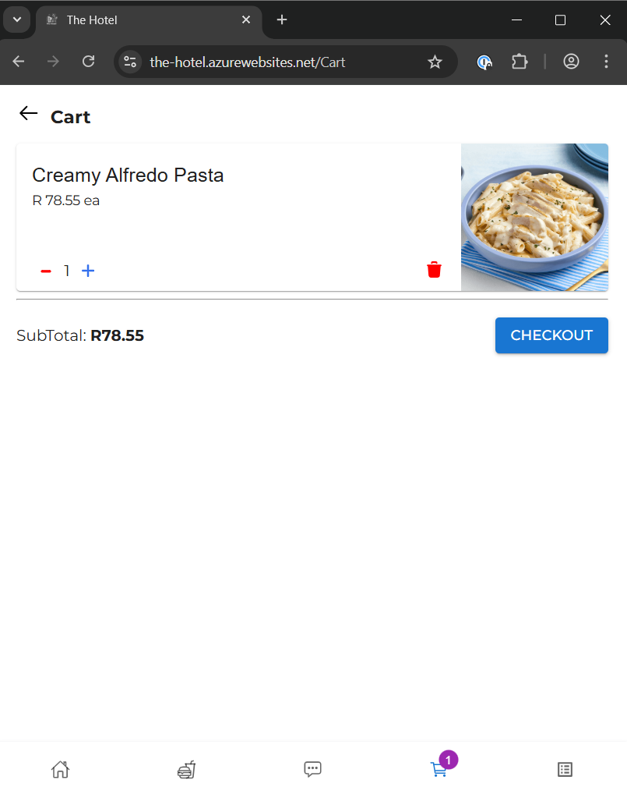  

***Messages Page***
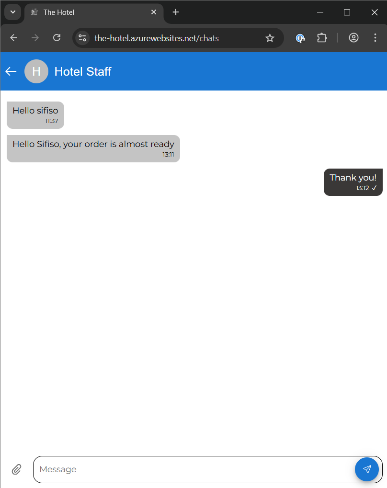  

***Explore Page***
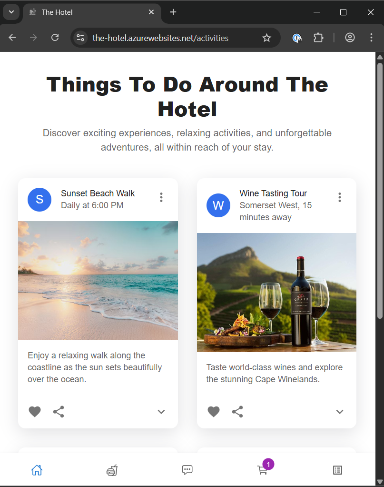  

### Staff Views
***Staff Dashboard***
  

***Order Details Page***
 

***Messages Page***
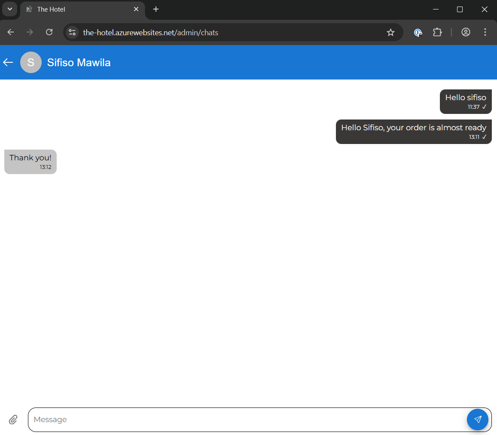 

***Analytics Page***
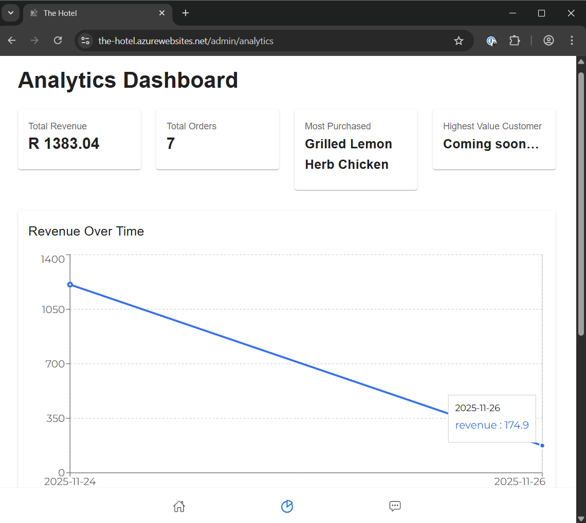  
